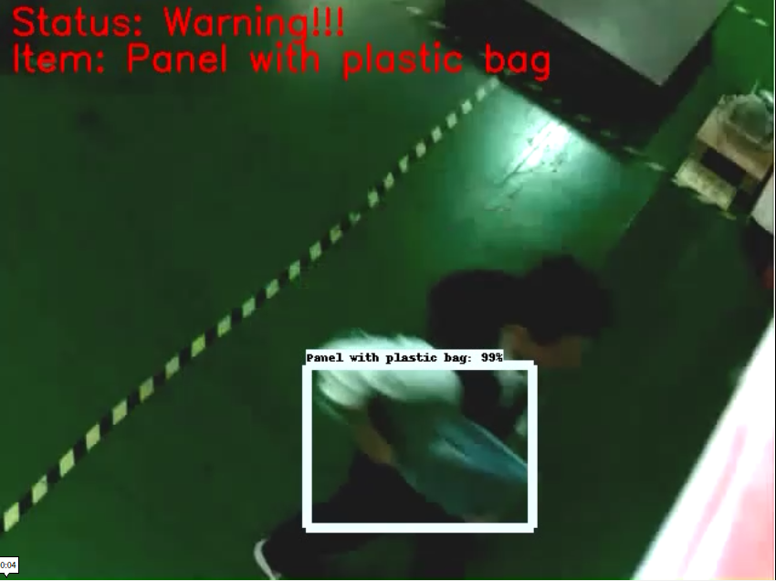
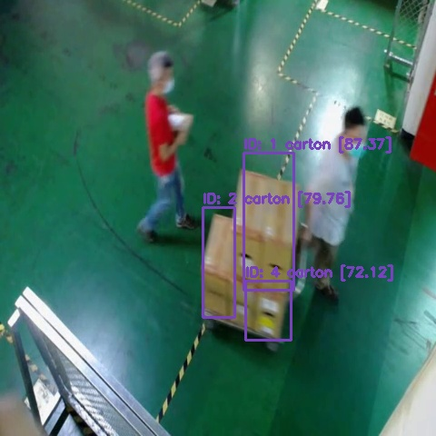

# 🚦 Smart Detection System  
### Using YOLOv4 + SORT Multi-Object Tracking

---

## 📘 專案簡介

本專案是一個以 **Python** 開發的智慧型偵測系統，能夠即時辨識與追蹤畫面中的物體，並偵測是否有物體朝「不允許方向」移動。  
整體系統整合了 **YOLOv4 物件偵測**、**SORT 多目標追蹤演算法** 與 **背景差分 (KNN Subtractor)**，可應用於智慧工廠、監控系統、自動化場域的安全偵測。

---

## 🎯 專案動機

在智慧製造或倉儲場域中，常需對特定通道或區域進行物品控管。  
傳統監控需要人工管控，並架設圍籬，效率低、成本高且容易疏漏。  
本專案旨在：
- 自動判斷是否拿取公司資產離開
- 自動判別移動方向是否違規
- 即時記錄觸發事件的畫面
- 降低人力監控成本，並運行於 Jetson Nano 等邊緣設備。

---

## 🧩 系統架構

```
YOLOv4 Object Detection → SORT Tracking → Direction Checking → Alert & Save
```

### 模組化結構設計

```
warehouse_management_smart_goalkeeper/
├─ bin/
│ └─ run_video.py        # CLI 入口
├─ src/
│ └─ darknet/ 
│ └─ Video_surveillance/ 
│   ├─ config.py         # 設定讀取與驗證
│   ├─ utils.py          # 工具模組
│   ├─ object_detection.py   # YOLO 模型推論方法
│   ├─ sort.py           # SORT 演算法
│   ├─ darknet.py        # YOLOv4 模型載入與推論
│   └─ Video_Surveillance.py  # 主程式  
├─ images/               # 圖片
├─ requirements.txt      # 套件需求
└─ README.md

```

---

## ⚙️ 系統流程

1. **背景減除 (KNN)**  
   透過背景分離判定當前畫面是否有「明顯運動」。  
   只有當偵測到足夠大的變化（超過最小面積）時才進行後續分析。

2. **YOLOv4 偵測**  
   在出現運動時使用 YOLOv4 模型辨識物件類型與邊界框。

3. **SORT 多目標追蹤**  
   使用卡爾曼濾波與 IOU 關聯維持每個物件的唯一 ID。

4. **方向違規檢查**  
   計算物件中心點軌跡，若跨越「不允許方向」的虛擬線（limit line），觸發警報。

5. **告警輸出與儲存**  
   將違規畫面以時間戳與設備號命名，儲存於指定路徑中，方便後續分析。

---

## 🧠 技術特色與優化

- **多目標追蹤與方向判定整合**  
  結合 YOLOv4 + SORT，實現穩定的目標 ID 維護與方向判斷。

- **可移植性**  
  已測試可運行於 **NVIDIA Jetson Nano / 標準 PC 環境**。

- **異常記錄自動化**  
  每次違規自動截圖存檔，方便人工稽核與報表生成。

---


## 📈 成果展示

- **減少架設圍牆費用 327萬**
- **物件偵測精準度 92.73%**

   

   

---
## 💻 使用方式

### 安裝需求

```bash
pip install -r requirements.txt
```

### 執行程式

```bash
python app.py --direction right --save_path ./outputs
```

### 主要參數說明

| 參數 | 預設值 | 說明 |
|------|---------|------|
| `--video` | None | 視訊來源，若未指定則使用 webcam |
| `--min_area` | 200 | 判定有運動的最小面積 |
| `--direction` | right | 禁止移動方向（right / left / up / down） |
| `--limit_line_rate` | 2 | 警戒線相對影格寬度比 |
| `--frame_size` | 480 | 影格縮放大小（正方形） |
| `--freq` | 5 | 每 N 幀分析一次 |
| `--save_path` | None | 告警畫面輸出資料夾 |
| `--computer_no` | 1 | 設備編號（用於檔名標示） |

---

## 🔧 硬體設備

| 設備 | 規格 | 用途 |
|------|------|------|
| Jetson Nano | 4GB RAM | 邊緣運算實驗與部署 |
| Desktop PC | i5 + RTX 1060 | 模型訓練與開發測試 |


---

## 🧍‍♂️ 個人貢獻

- 實作並優化 YOLOv4 + SORT 的整合流程。
- 設計方向判斷與告警機制，支援多方向限制。
- 架設邊緣裝置並整合公司通訊軟體

---

## 📈 未來展望

- 支援多攝影機串流整合。
- 引入輕量化模型（YOLOv8n）提升即時性。
- 加入事件日誌資料庫與 Web 前端可視化介面。
- 結合 MQTT / Kafka 以實現 IoT 警報通知。


